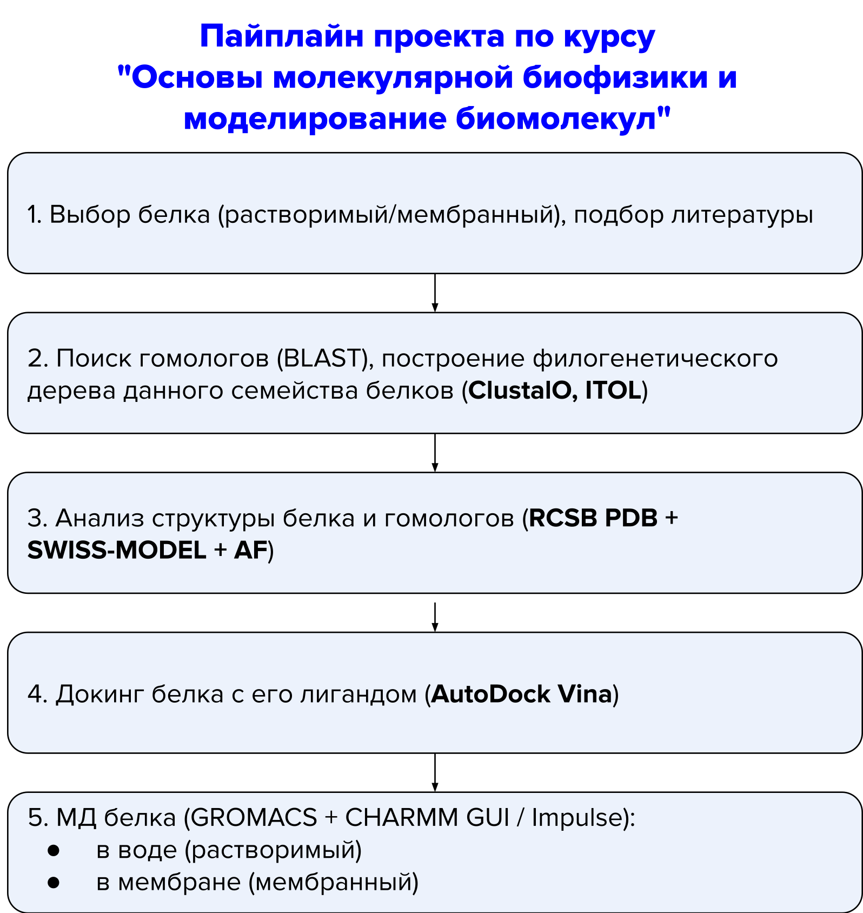

# Основы молекулярной биофизики и моделирования биомолекул

Репозиторий курса **«Основы молекулярной биофизики и моделирования биомолекул»**, читающегося в осеннем семестре 2025 года для студентов 4 курса кафедры «Вычислительная физика конденсированного состояния и живых систем» ЛФИ МФТИ.

# Описание курса

В рамках курса рассматриваются ключевые аспекты молекулярной биологии и компьютерного моделирования, позволяющие предсказывать и анализировать структуру и функции биологических систем. Практическая часть курса включает визуализацию молекул (PyMOL), работу с биоинформатическими базами данных (UniProt, PDB), предсказание белковых структур (SWISS-MODEL, AlphaFold), молекулярный докинг (AutoDock Vina) и основы молекулярной динамики (GROMACS).

# Лекции

| № | Дата   | Описание                                                                                                                                                                                                                                                                                                                                                                                             |
| -- | ---------- | ------------------------------------------------------------------------------------------------------------------------------------------------------------------------------------------------------------------------------------------------------------------------------------------------------------------------------------------------------------------------------------------------------------ |
| 1  | 04.09.2025 | [Введение. Увидеть невидимое. Галопом по европам](https://github.com/Gressy2113/MolMod_2025/blob/main/Lectures/1-%D0%A7%D1%83%D0%B3%D1%83%D0%BD%D0%BE%D0%B2.%D0%9C%D0%A4%D0%A2%D0%98_%D0%93%D0%B0%D0%BB%D0%BE%D0%BF%D0%BE%D0%BC_%D0%BF%D0%BE_%D0%95%D0%B2%D1%80%D0%BE%D0%BF%D0%B0%D0%BC_2025-09-04.pdf)                                                                 |
| 2  | 18.09.2025 | [Разнообразие, строение и методы исследования белков](https://github.com/Gressy2113/MolMod_2025/blob/main/Lectures/2-%D0%A7%D1%83%D0%B3%D1%83%D0%BD%D0%BE%D0%B2.%D0%9C%D0%A4%D0%A2%D0%98%20-%20%D0%A1%D1%82%D1%80%D1%83%D0%BA%D1%82%D1%83%D1%80%D0%B0%20%D0%B1%D0%B5%D0%BB%D0%BA%D0%B0.2023-09-21.pdf)                                                             |
| 3  | 02.10.2025 | [Биоинформатика: «текстовая» и «структурная». Базы данных](https://github.com/Gressy2113/MolMod_2025/blob/main/Lectures/3-%D0%A7%D1%83%D0%B3%D1%83%D0%BD%D0%BE%D0%B2.%D0%9C%D0%A4%D0%A2%D0%98%20-%20%D0%91%D0%B0%D0%B7%D1%8B%20%D0%B4%D0%B0%D0%BD%D0%BD%D1%8B%D1%85.2025-10-02.pdf)                                                                            |
| 4  | 16.10.2025 | [Предсказание структуры белков на основе гомологии](https://github.com/Gressy2113/MolMod_2025/blob/main/Lectures/4-%D0%A7%D1%83%D0%B3%D1%83%D0%BD%D0%BE%D0%B2.%D0%9C%D0%A4%D0%A2%D0%98%20-%20%D0%9C%D0%BE%D0%B4%D0%B5%D0%BB%D0%B8%D1%80%D0%BE%D0%B2%D0%B0%D0%BD%D0%B8%D0%B5%20%D0%BF%D0%BE%20%D0%B3%D0%BE%D0%BC%D0%BE%D0%BB%D0%BE%D0%B3%D0%B8%D0%B8.2023-10-19.pdf) |

# Практикумы

## Необходимый софт

* [PyMol](https://www.pymol.org/) для визуализации биомолекул
* [VSCode](https://code.visualstudio.com/)/[JupyterLab](https://jupyter.org/) для работы с jupyter-ноутбуками

| № | Дата   | Описание                                                                                                                                                                                                                                                                                 |
| -- | ---------- | ------------------------------------------------------------------------------------------------------------------------------------------------------------------------------------------------------------------------------------------------------------------------------------------------ |
| 1  | 11.09.2025 | [PyMol. Основы представления молекул. Синтаксис. Первый взгляд на Uniprot/RCSB и PDB.](https://github.com/Gressy2113/MolMod_2025/blob/main/Seminars/Seminar1/Seminar1.ipynb)                                                                      |
| 2  | 25.09.2025 | [Структура аминокислот и белков в PyMOL.](https://github.com/Gressy2113/MolMod_2025/blob/main/Seminars/Seminar2/Seminar2.ipynb)                                                                                                                                         |
| 3  | 09.10.2025 | [Текстовая биоинформатика. Работа с последовательностями. Базы данных, выравнивание, филогенетические деревья](https://github.com/Gressy2113/MolMod_2025/blob/main/Seminars/Seminar3/Seminar3.ipynb) |
| 4  | 23.10.2025 | [Методы предсказания структуры белков](https://github.com/Gressy2113/MolMod_2025/blob/main/Seminars/Seminar4/Seminar4.ipynb)                                                                                                                                       |

# Домашние задания

* **Дедлайны**: ДЗ сдаются в течение двух недель после практикума (дедлайн - следующий практикум)
* **Оценивание**: Каждое задание оценивается в 1 балл.

- **Штрафы:** за каждую неделю задержки снимается 0.25 балла.

| № | Дедлайн | Описание                                                                                                                                                                                                                                                                                                                                                                                                                                                                                                                                                                                                                                                                                                                                                                                                                                                                                                                                                                                                |
| -- | -------------- | --------------------------------------------------------------------------------------------------------------------------------------------------------------------------------------------------------------------------------------------------------------------------------------------------------------------------------------------------------------------------------------------------------------------------------------------------------------------------------------------------------------------------------------------------------------------------------------------------------------------------------------------------------------------------------------------------------------------------------------------------------------------------------------------------------------------------------------------------------------------------------------------------------------------------------------------------------------------------------------------------------------- |
| 1  | 25.09.2025     | Найти статью, описывающую белок, который вас интересует. Ваша задача — выбрать любую картинку из статьи и воссоздать её в Pymol. Нужно прислать: * PDF статьи * Номер картинки * Файлы `.png` и `.pse` с вашей картинкой в Pymol                                                                                                                                                                                                                                                                                                                                                                                                                                                                                                                                                                                            |
| 2  | 09.10.2025     | 1.**(0.3 балла)** Построить карту Рамачандрана для пептида из 15-20 остатков "руками", измеряя и переписывая углы в PyMOL 2. **(0.7 баллов)** Написать программу для измерения двугранных углов и построения scatter/contour plot для одной структуры из PDB 3. **(1 балл)** Написать программу из п.2., применить ее на датасете из многих структур и сравнить карты Рамачандрана, построенные для разных типов остатков                                                                                                                                                                                                                                                                  |
| 3  | 23.10.2025     | 1.**BLAST**: найдите группу из 5 и более белков с идентичностью последовательностей от 10% до 100% 2. **ClustalO**: постройте множественное выравнивание аминокислотных последовательностей данных белков.  3. **ClustalO+ITol**: постройте и нарисуйте филогенетическое дерево группы  Нужно прислать:  * Uniprot+PDB_ID исходного белка * файл с множественным выравниванием * percent identity matrix * 2 картинки с деревьями, построенными методами UPGMA и NJ                                                                                                                                                                                 |
| 4  | 06.11.2025     | Для Вашего белка (выбранного для проекта): * Провести моделирование по гомологии в **SWISS-MODEL**  * Найти структуру белка в **AlphaFold Database** * Построить структуру белка на **AlphaFold Server** * Сравнить полученные структуры в PyMOL, сделать выводы о качестве моделей  Нужно прислать:  * Аминокислотную последовательность белка, UNIPROT/PDB ID * Экспериментальную структуру * Смоделированные структуры SWISS-MODEL, AF datbase, AF server * Текст с кратким анализом качества полученных структур + прикрепить картинки из PyMOL/прислать PyMOL-сессию. |

# Финальный проект

В качестве проекта можно выбрать одну из двух опций:

* Разработка собственного проекта/инициативы.
* Применение всех домашних заданий к одному белку с последующей компиляцией результатов в один отчет.

